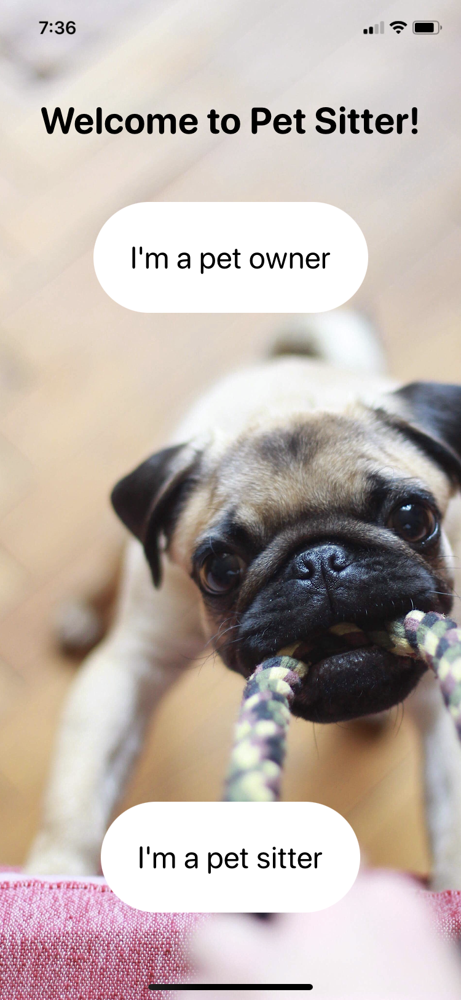

# PetSitter :paw_prints:

## Summary

**PetSitter** is an app that helps to connect pet owners with pet sitters.

   

## Overview

* [Tech Stack](#tech-stack)
* [Features](#features)

## Tech Stack

__iOS Development:__ Swift, SwiftUI, JSON Persistence  
__Framework:__ MapKit  

## Features
1. Ability to create post and store it with the images in JSON file in persistance store.
2. Ability to convert zipcode address to the lat ang long coordinates, using CLGeocoder class.
3. Ability to present users on a Map and show all of them that are nearby the pet owner location.
4. Ability to click on red circle and see the detailed user viem.
5. Ability to click on a phone number and make a call right away.
6. ABility to search through the list of post to find a pet sitter with given criterias. 
